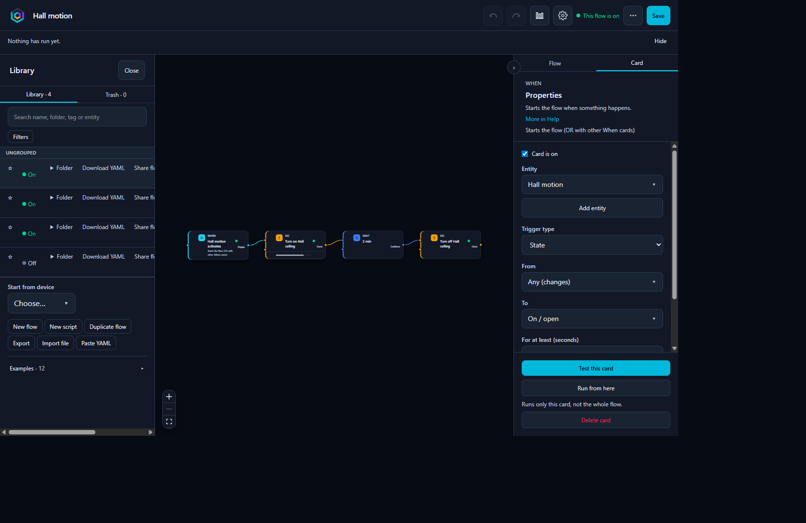
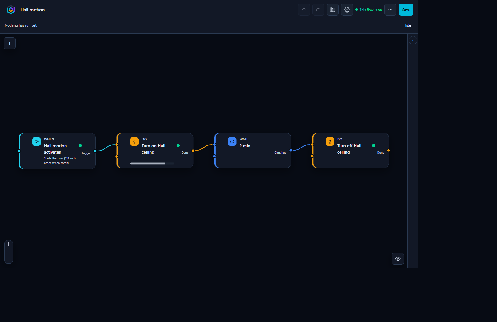
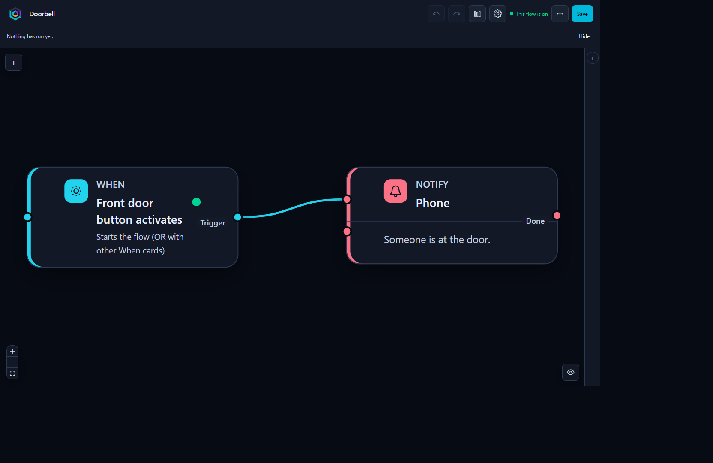

<div align="center">


</div>

<h1 align="center">Oquanta</h1>

<p align="center">Visual flow editor for Home Assistant</p>

<p align="center">
  <a href="README.sv.md">Svenska</a>
</p>

<p align="center">
  
  
  
</p>

Oquanta adds a Homey-style canvas to the Home Assistant sidebar. You draw **When**, **If**, and **Do** cards; Home Assistant runs the result as a normal automation or script. The graph is the editor. Home Assistant is the runtime.

This repository is the **installable integration** (`custom_components/oquanta`). Editor source lives in a separate private repo.

The panel follows Home Assistant’s language (English or Swedish).



The library keeps each flow, and shows whether it is on.



Hall motion turns the ceiling light on, waits two minutes, then turns it off. The dot is the light’s live state.



The front door button sends a notice to a phone.

---

## Requirements

Home Assistant OS, Supervised, or Container. Administrator. Restart Core after install. The path is always `/config/custom_components/oquanta`.

## Install

### HACS

1. Open [Add Oquanta in HACS](https://my.home-assistant.io/redirect/hacs_repository/?owner=DarkSoulXs&repository=oquanta&category=integration), or in HACS: **⋮ → Custom repositories**, URL `https://github.com/DarkSoulXs/oquanta`, type **Integration**.
2. Download/install Oquanta, then restart Home Assistant Core.
3. Open **Settings → Devices & services → Add integration → Oquanta**.
4. Open **Oquanta** in the sidebar.

Existing yaml `oquanta:` is imported automatically as a config entry (backward compatible). Do not add a new yaml block for a fresh install.

### Manual zip

1. Download the zip from [Releases](https://github.com/DarkSoulXs/oquanta/releases).
2. Unpack it and copy the folder `custom_components/oquanta` to:

   ```text
   /config/custom_components/oquanta
   ```

3. Open **Settings → Devices & services → Add integration → Oquanta**.
4. Restart Home Assistant Core if the sidebar item is missing.
5. Open **Oquanta** in the sidebar.

Samba or Studio Code: the same folder, next to your other custom components, then restart.

### Updates

If you installed via HACS, update in HACS. Oquanta also checks GitHub Releases on startup and every twelve hours and can show its own banner. Use **one** update path, not both.

Manual zip: download a newer zip and overwrite the folder.

## What is there

- Flows that Home Assistant runs as automations or scripts
- Everyday starters: motion, doors, leaks, doorbells, temperature, and lights before sunset
- A live dot on each card, so you can see if the entity is on or off
- A library, and a list on your phone
- An Assist phrase for a script
- A dashboard card that lists your flows and can run one

Please report issues under [Issues](https://github.com/DarkSoulXs/oquanta/issues).

## Uninstall

Remove the Oquanta integration under **Settings → Devices & services**, delete `/config/custom_components/oquanta`, restart Core. If you still have yaml `oquanta:`, remove that too. Automations with id `oquanta_*` and scripts `script.oquanta_*` can be removed in the Home Assistant automations and scripts UI.

## License

MIT. Copyright DarkSoulXs. See [LICENSE](LICENSE).
