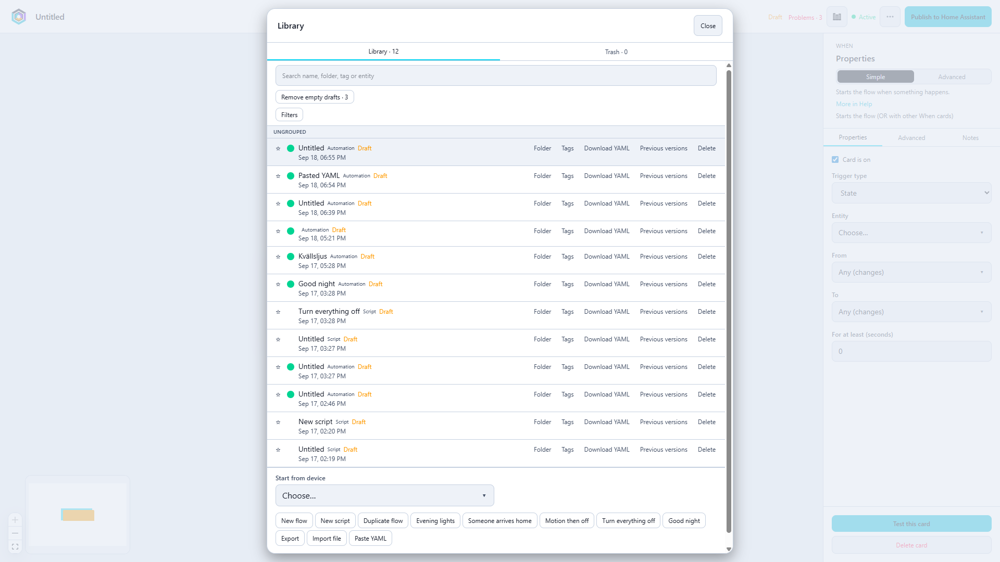
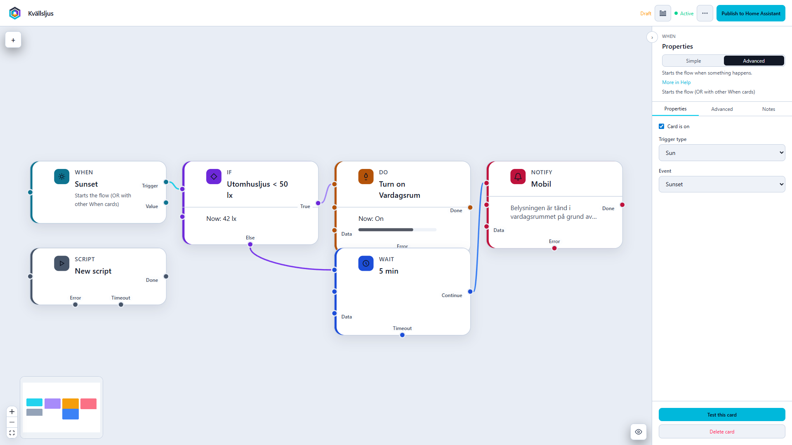
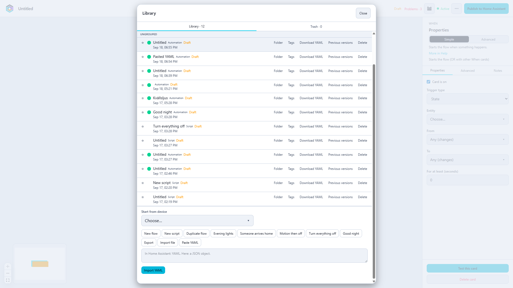

<div align="center">


</div>

<h1 align="center">Oquanta</h1>

<p align="center">Visuell flödeseditor för Home Assistant</p>

<p align="center">
  <a href="README.md">English</a>
</p>

<p align="center">
  
  
  
</p>

Oquanta lägger en Homey-lik duk i Home Assistants sidomeny. Du ritar **När**, **Om** och **Gör**; Home Assistant kör resultatet som en vanlig automation eller ett skript. Grafen är editorn. Home Assistant är runtime.

Det här repot är **installationen** (`custom_components/oquanta`). Källkoden för editorn ligger i ett separat, privat repo.

Panelen följer Home Assistants språk (svenska eller engelska).







---

## Krav

Home Assistant OS, Supervised eller Container. Administratör. Omstart av Core efter installation. Sökvägen är alltid `/config/custom_components/oquanta`.

## Installation

### HACS

1. Öppna [Lägg till Oquanta i HACS](https://my.home-assistant.io/redirect/hacs_repository/?owner=DarkSoulXs&repository=oquanta&category=integration), eller i HACS: **⋮ → Custom repositories**, URL `https://github.com/DarkSoulXs/oquanta`, typ **Integration**.
2. Ladda ner/installera Oquanta, starta sedan om Home Assistant Core.
3. Öppna **Inställningar → Enheter och tjänster → Lägg till integration → Oquanta**.
4. Öppna **Oquanta** i sidomenyn.

Befintlig yaml `oquanta:` importeras automatiskt som config entry (bakåtkompatibilitet). Ny installation behöver inte `configuration.yaml`.

### Manuell zip

1. Ladda ner zip från [Releases](https://github.com/DarkSoulXs/oquanta/releases).
2. Packa upp och kopiera mappen `custom_components/oquanta` till:

   ```text
   /config/custom_components/oquanta
   ```

3. Öppna **Inställningar → Enheter och tjänster → Lägg till integration → Oquanta**.
4. Starta om Home Assistant Core om sidomenyn saknar Oquanta.
5. Öppna **Oquanta** i sidomenyn.

Samba eller Studio Code: samma mapp, bredvid dina andra custom components, sedan omstart.

### Uppdateringar

Installerade du via HACS: uppdatera i HACS. Oquanta kollar också GitHub Releases vid start och var tolfte timme och kan visa en egen banner. Använd **en** uppdateringsväg, inte båda.

Manuell zip: ladda ner en nyare zip och skriv över mappen.

## Vad som finns

- Flöden som blir native Home Assistant-automationer (`oquanta_<id>`) eller skript (`script.oquanta_*`)
- Bibliotek med mappar, taggar, pin, sök och rensning av tomma utkast
- Live-katalog från din instans (entiteter, områden, tjänster)
- Data-portar, anteckningar, ramar och YAML-import/export
- Live-test mot huset (`automation.trigger` / `script.turn_on`) — **tänder och släcker på riktigt**
- Förhandsgranskning av villkor mot aktuella tillstånd, utan att köra åtgärder

Rapportera gärna fel under [Issues](https://github.com/DarkSoulXs/oquanta/issues).

## Avinstallation

Ta bort integrationen under **Inställningar → Enheter och tjänster**, radera `/config/custom_components/oquanta`, starta om Core. Har du kvar yaml `oquanta:` tar du bort den också. Automationer med id `oquanta_*` och skript `script.oquanta_*` kan tas bort i Home Assistants automations- och skriptvy.

## Licens

MIT. Copyright DarkSoulXs. Se [LICENSE](LICENSE).
